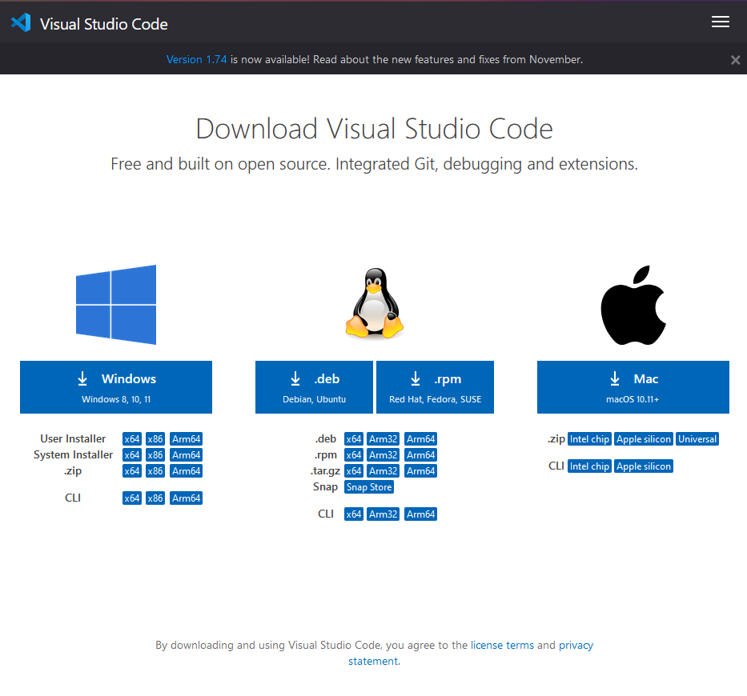
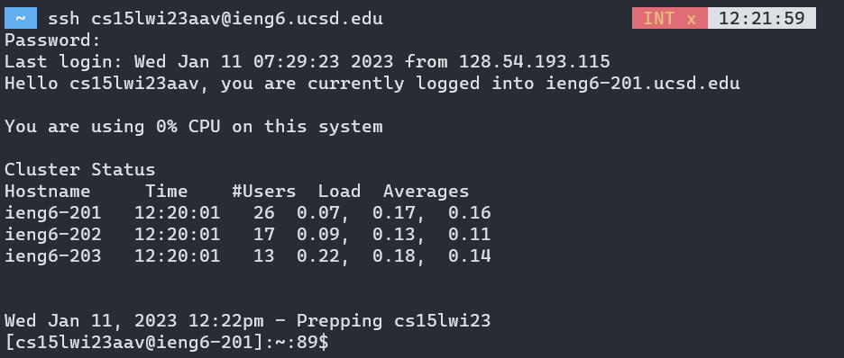
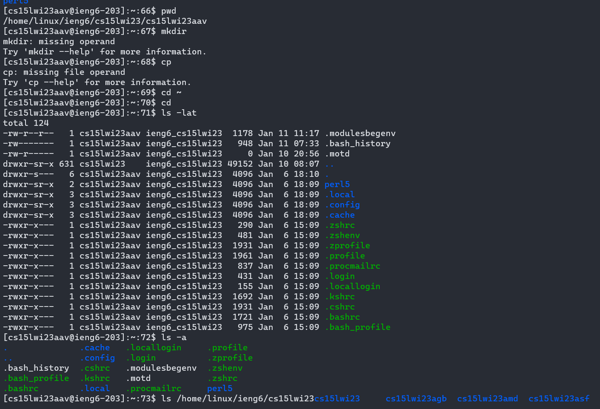

## Installing Visual Studio Code

One of our first tasks in this lab was to install Visual Studio Code, which is an integrated development environment for writing code. Like many other students, I already had visual studio code installed on my computer due to previous CSE courses. However, if I didn't, the installation process would look something like this.

1) Navigate to [https://code.visualstudio.com/download](https://code.visualstudio.com/download). You should see something like this:



2) Click on the correct operating system. For me, this was Windows.
3) Follow the installation instructions provided. On Windows, an installer would be downloaded, which we would have to run.
4) If the instructions were followed correctly, Visual Studio Code should be installed! On windows, it can be run by pressing the windows key and searching `VSC`

## Remotely Connecting

For our lab, we needed to connect to our CSE15L account provided by the university. The first step is to get our account information, which requires resetting our password. We first navigate to the [Account Lookup Page](https://sdacs.ucsd.edu/~icc/index.php) and input our username and PID. After clicking "Submit Query", under the "Additional Accounts" section, we should see our CSE15L account username. Then, we head to the [Global Password Reset Tool](https://sdacs.ucsd.edu/~icc/password.php) to change our password. The page tells us to enter none for our student ID, however you should still enter your PID, or else it will not work. Then, you can enter a new password.

Next, we move on to actually connecting on remote. We will use the ssh protocol to do this. One way to do this is to open Visual Studio Code, and use the terminal. However, I had Windows Subsystem for Linux (WSL) installed, so I used that. To connect, type the following, replacing username with your CSE15L username.
```
$ ssh username@ieng6.ucsd.edu
```
It should then prompt for your password, which you also type in. What you type for the password is hidden, as the password is supposed to be secret. If your password was correct, you should be connected to a CSE server and should see something similar to the following: 



## Trying Some Commands

I then tried some bash commands on the linux server. Some notable ones were:

* `cd directory` changes the current directory to whatever is specified in "directory"
* `cd ~` changes the current directory to your home directory
* `ls -lat` lists all files (including hidden files) with their permissions and other information

`cp /home/linux/ieng6/cs15lwi23/public/hello.txt ~/` did not work as the file `hello.txt` did not exist in the specified directory. I verified such by checking the contents of the directory with `ls /home/linux/ieng6/cs15lwi23/public/ -a`, which showed that no such file existed.

Here is a screenshot of me trying the commands out

