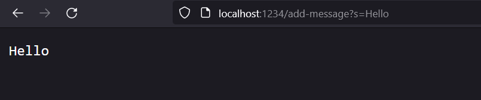
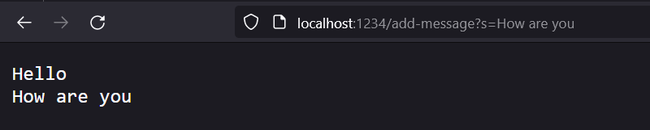
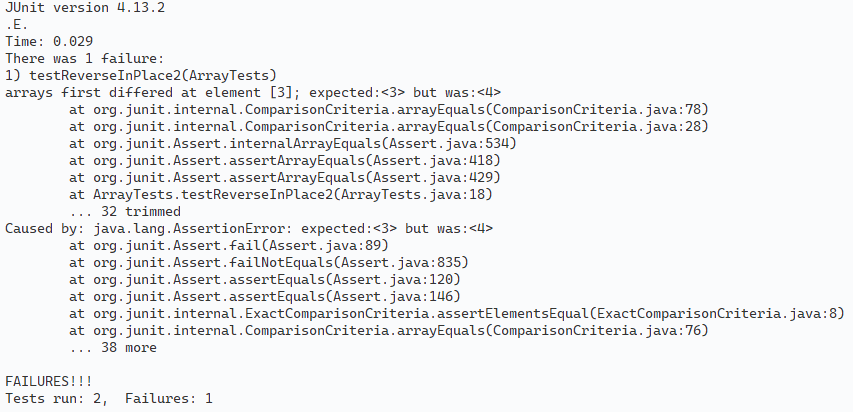

## Part 1: Implementing StringServer

StringServer is simply a webserver which allows you to add strings to global storage. You can see the usage below. First we add the string `Hello`, then the string `How are you` is added, resulting in the output shown.



The code for StringServer is as follows. The string `saved` globally stores all our strings. When we add the first string with the request `http://localhost:1234/add-message?s=Hello`, the `handleRequest` method is passed the URL. Detecting that the first query is `add-message`, it concatenates the string with `saved`, resulting in `Hello`. Next, `How are you` is passed in with the request `http://localhost:1234/add-message?s=How%20are%20you`, which, following the same execution, is concatenated to `saved` with a new line, resulting in it not storing `Hello\nHow are you`.

```java
// StringServer.java


import java.io.IOException;
import java.net.URI;

class StringServerHandler implements URLHandler {

    String saved = "";
    String[] parameters;

    public String handleRequest(URI url) {

        if (url.getQuery() != null) {
            parameters = url.getQuery().split("=");
        } else {
            parameters = new String[0];
        }

        if (url.getPath().equals("/add-message")) {
            if (parameters[0].equals("s")) {
                if ("".equals(saved)) {
                    saved = parameters[1];
                } else {
                    saved += "\n" + parameters[1];
                }
            }
            return saved;
        }

        return "Error!";
    }
}


class StringServer {
    public static void main(String[] args) throws IOException {
        if (args.length == 0) {
            System.out.println("Missing port number! Try any number between 1024 to 49151");
            return;
        }

        int port = Integer.parseInt(args[0]);

        Server.start(port, new StringServerHandler());
    }
}
```

## Part 2: Bugs

For now, I will analyze the `reverseInPlace` method, which contains a bug. As the method is incorrectly implemented, it will generate the incorrect output for some inputs. One input that that generates the incorrect output is `{1, 2, 3, 4, 5, 6}`, which will be modified into `{6, 5, 4, 4, 5, 6}`, whereas the correct result is `{6, 5, 4, 3, 2, 1}`. The JUnit test for this is as follows:

```java
@Test
public void testReverseInPlace2() {
    // This test fails for our implementation
    int[] input = {1, 2, 3, 4, 5, 6};
    int[] expected = {6, 5, 4, 3, 2, 1};
    ArrayExamples.reverseInPlace(input);
    assertArrayEquals(expected, input);
}
```

However, there are also some inputs that the method will output correctly, despite it being incorrectly implemented. One such input is the empty array, which the method keeps the same:

```java
@Test
public void testReverseInPlace3() {
    // This test passes for our implementation
    int[] input = {};
    int[] expected = {};
    ArrayExamples.reverseInPlace(input);
    assertArrayEquals(expected, input);
}
```

Running these two tests, we can see that as a symptom, the former method fails and the latter passes.



The buggy code is as shown. Observe that, as we start replacing values in the front of the array with those at the end, the first half of the array gets overwritten with it's replaced values, so when `i > array.lengh / 2`, it copies those replaced values instead of the original values.

```java
static void reverseInPlace(int[] arr) {
    for (int i = 0; i < arr.length; i += 1) {
        arr[i] = arr[arr.length - i - 1];
    }
  }
```

I edited the code to correctly reverse an Array in place. It swaps each pair of values using a temp variable, so no incorrect values are copied.

```java
static void reverseInPlace(int[] arr) {
    int temp;
    for (int i = 0; i < arr.length / 2; i += 1) {
        temp = arr[i];
        arr[i] = arr[arr.length - i - 1];
        arr[arr.length - i - 1] = temp;
    }
}
```

## Part 3: What I learned

In Lab 2, I learned how to create a very basic webserver by processing URLs using the httpserver library. In Lab 3, I learned how to run JUnit tests using the command line, read and understand JUnit output, and how to debug files based on the JUnit output. I further learned a bit on how and which tests to write to effectively test methods.