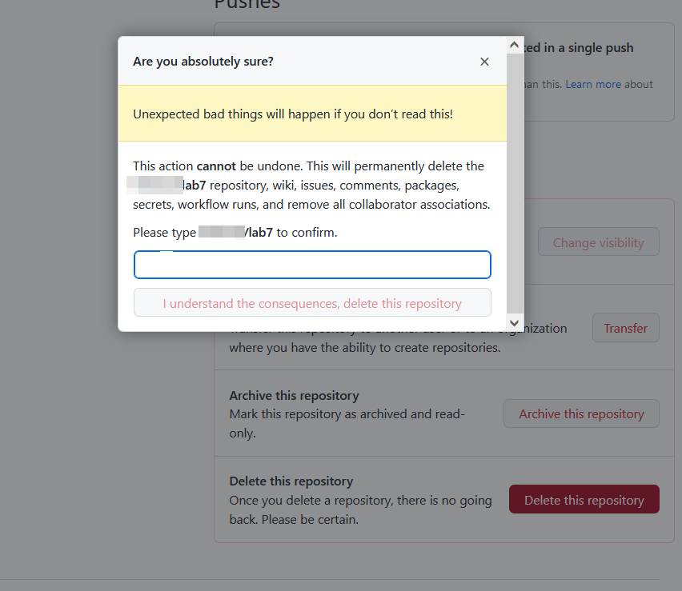
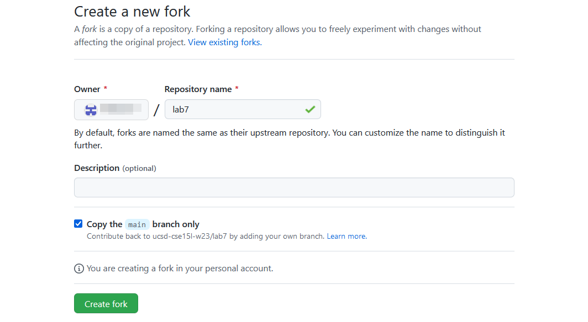

## Step 1: Setup

Delete any existing forks of the repository on your account.

I navigated to `github.com`, I just typed the beginning of the phrase and hit `<enter>` as by browser autocompletes it. I then click on the `lab7` repository, Click on the gears icon to go to repository settings, scroll down to the bottom, click "Delete this repository" and enter my repository username: `<github username>/lab7`, and click the button to confirm deletion.

## Step 2: Setup, again

Fork the repository.

On the CSE 15L week 7 course page, I clicked on the link leading to the repository we are supposed to fork. I then click the "fork" button in the upper right corner, and then click the green "create fork".

## Step 3: The real deal

Start the timer.

On my phone, I already had the clock app open and was on the stopwatch page, so I clicked the button shaped like a triangle, which starts a stopwatch.

## Step 4:

Log into ieng6

To ssh into ieng6, I type  `ssh cs15lwi23aav<at>ieng6<dot>ucsd<dot>edu<space><hyphen>i<space><tilda><backslash><dot>ssh<backslash>cse15l`.

This ssh's me into my CSE15L remote account using a ssh key, so I don't have to type in my passowrd. I have to include the extra `-i` because my key is not stored in the default location. For some reason, my CSE15L remote account spams me with errors after logging in.

## Step 5:

Clone your fork of the repository from your Github account.

I type `git<space>clone<space>git<at>github<dot>com<colon>helisoai<backslash>lab7<dot>git` to clone the github repository onto the server.

## Step 6

Run the tests, demonstrating that they fail.

First, I `cd` into the cloned directory: `cd lab7`. Then, to compile and run the tests, I nagivate to the week 3 page on the CSE 15L course page by hovering over "weeks" and then clicking on "Week 3". Then, I scroll down until the "Setup" section. I highlight the first line of the code under "Mac users" and copy and paste `<ctrl>c`, paste it into my terminal `<ctrl>v`, and execute `<enter>`.  I then highlight and copy and paste (`<ctrl>c<ctrl>v`) the second line into the terminal and replace "ArrayTests" with "TestListExamples" and run it: `<ctrl><backspace>ListExamplesTests<enter>`

## Step 7

Edit the code file to fix the failing test.

I use vim to replace fix the incorrect code. I type `vim ` to open the file, then `43gg<left arrow><backspace>i<backspace>2<esc><colon>wq` to navigate to the line, navigate to the incorrect character, replace the incorrect character, and save the file. 

## Step 8

Run the tests, demonstrating that they now succeed.

I just need to repeat the steps of step 6. I reuse the commands without typing them with bash's history function by pressing the up arrow. `<up><up><up><enter>` to compile the files again and `<up><up><up><enter>` to run the test.

## Step 9

Commit and push the resulting change to your Github account

I type `git<space>add<space><dot>` to commit, `git<space>commit<space><hyphen>m<space><double quote>e<double quote>` to commit, and `git<space>push` to push the changes.

